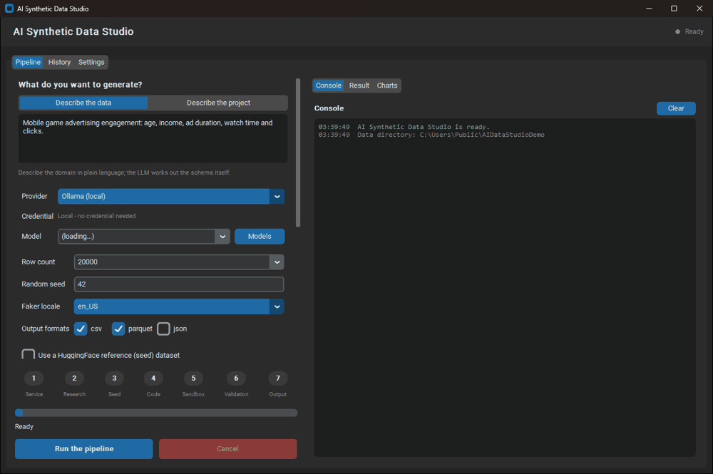
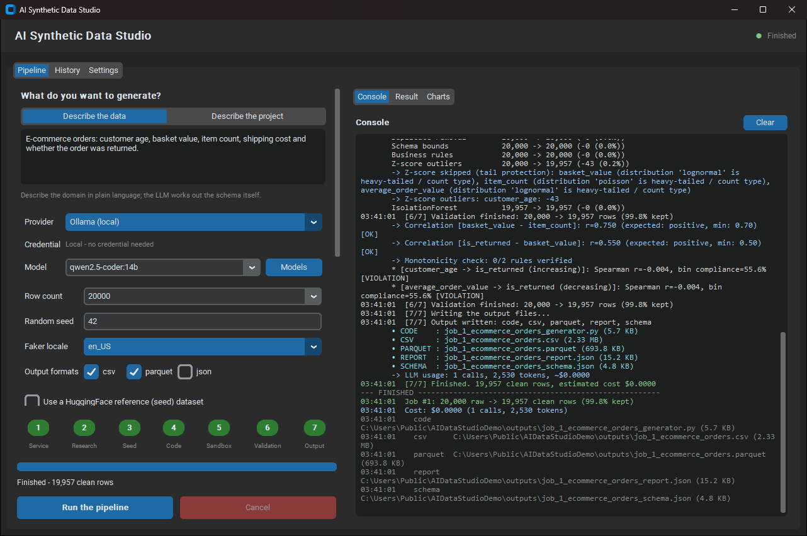
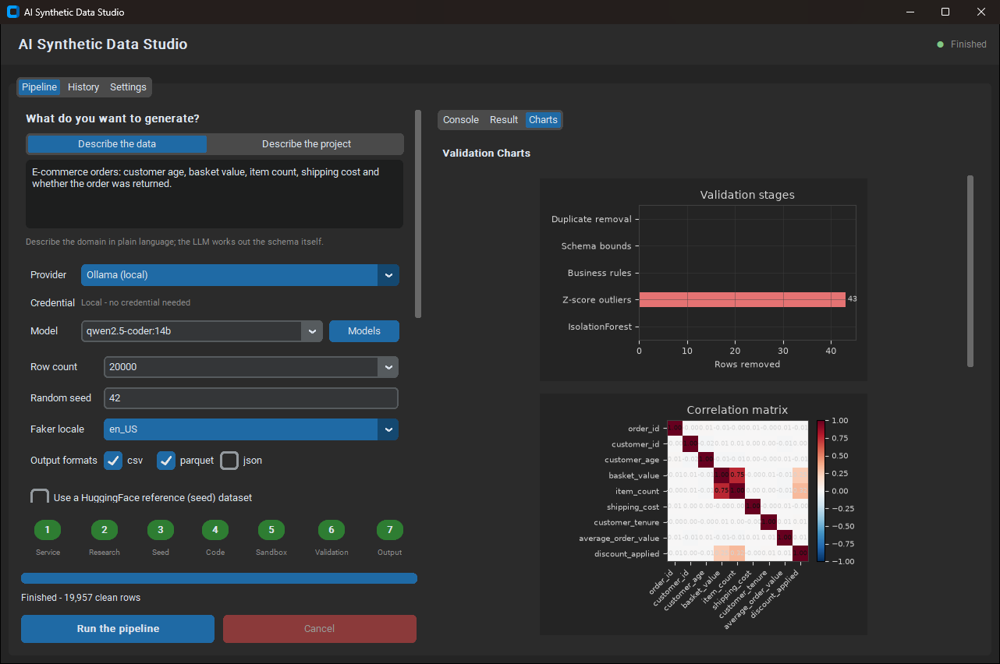
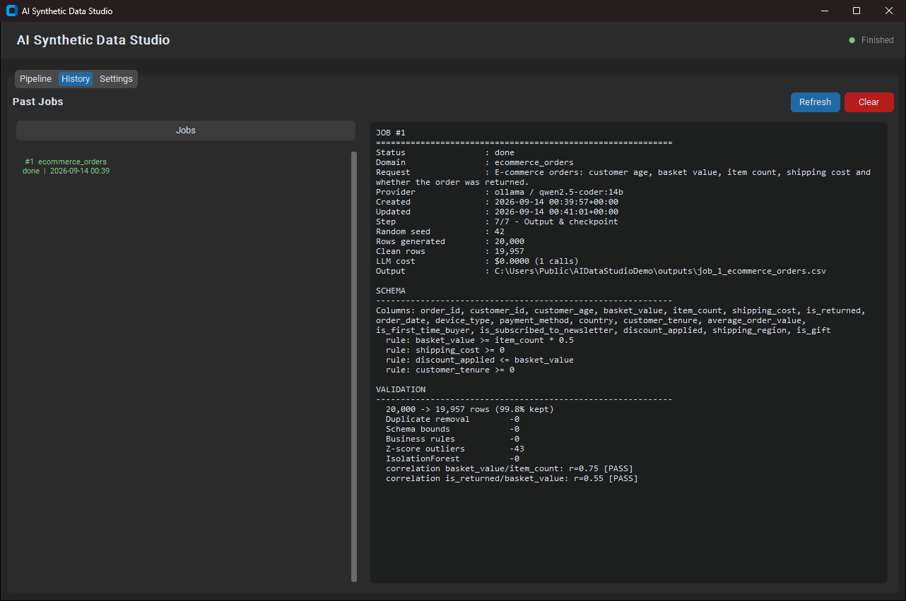

# AI Synthetic Data Studio

> Contract-based synthetic data generation and statistical validation engine — local-first &
> air-gapped capable, with zero required API dependencies.

<p align="center">
  
</p>

<p align="center">
  <a href="https://github.com/BurakYildizGameDev/ai-data-studio/actions/workflows/ci.yml"></a>
  <a href="https://www.python.org/downloads/"></a>
  <a href="LICENSE"></a>
  <a href="https://github.com/astral-sh/ruff"></a>
</p>

<p align="center">
  
  <br>
  <sub>15-second tour of the desktop studio — local Ollama <code>qwen2.5-coder:14b</code>, parametric engine, 20,000 rows.
  Only the LLM's schema step is sped up; everything else plays in real time. A run on the 1.5B model is
  <a href="#first-dataset-in-two-minutes">measured below</a>. (<a href="docs/media/demo.mp4">MP4</a>)</sub>
</p>

---

## Why this exists

Why ask an LLM to write rows one token at a time? Let the local model write a Schema Contract,
then compile and validate millions of rows in seconds. Zero API bills, no data leaves your
machine.

Describe a dataset in plain language. A small local model writes the contract, the engine
generates the rows, and a validator checks that the data keeps the contract — no API key
required. One LLM call covers ten rows or ten million, so the cost of a dataset stops being a
function of its size, and every row can be checked against something you can read.

---

## How it works

This project asks the model for something much smaller than the data itself: a **Schema
Contract** — a JSON description of the columns, distributions, business rules, correlations
and monotonic relationships the data should have.

```
description ──LLM──> Schema Contract ──engine──> raw rows ──validator──> clean rows + report
                          (JSON)        parametric compiler, or an
                                        LLM-written generator program
```

1. **Contract.** One LLM call — local Ollama, Google Gemini or Anthropic Claude — turns your
   description into a contract. Formatting mistakes whose meaning is clear are repaired;
   ambiguous ones are sent back to the model.
2. **Generate.** The parametric engine compiles the contract into NumPy/pandas vectors: the
   declared distributions, a Gaussian copula for correlations and monotonic trends, and
   business rules repaired during generation. Alternatively (`--engine llm`) the model writes
   a generator program that runs in a separate process.
3. **Validate.** The validator removes duplicates, out-of-range values and rule violations,
   filters outliers without cutting heavy tails, and then *measures* whether each declared
   correlation and monotonic trend actually holds.
4. **Export.** CSV, Parquet or JSON, plus the contract, a JSON report, a script that
   regenerates the data offline and, optionally, a Hugging Face dataset card.

Because the model only writes the contract, a 1.5B model on an ordinary laptop is enough, and
the number of rows does not change the number of LLM calls. Compiling the contract is the
cheap part: a million rows across ten columns takes about two seconds and 270 MB —
[measure it on your machine](benchmarks/RESULTS.md).

> **The validator checks the data against the contract, not against the real world.** A small
> model can declare a relationship that runs the wrong way for your domain. Read the generated
> `*_schema.json` before you rely on the data.

---

## First dataset in two minutes

### With a small local model

[Install the project](#installation) and [Ollama](https://ollama.com/), then:

```bash
ollama pull qwen2.5-coder:1.5b      # about 1 GB; runs without a GPU

python -m ai_data_studio.core.orchestrator \
    --domain "loan applications with income, credit score and default flag" \
    --provider ollama --model qwen2.5-coder:1.5b \
    --engine parametric --rows 20000 --formats csv
```

On the development machine (Intel i9-13900HX, RTX 5070 Ti) this run took 16 seconds end to
end: one LLM call of 1,814 tokens, 19,636 of 20,000 rows kept, 3 of 3 declared correlations
and 1 of 1 monotonicity rule met. On a machine without a GPU the LLM call takes longer;
generation and validation do not use the GPU.

That run is also a good example of the warning above: the model declared that defaults
*rise* with income. The data honours the contract; the contract is wrong for the domain.

Over nine runs on three different prompts, `qwen2.5-coder:1.5b` with the parametric engine
finished every run and met 25 of 26 declared correlations — see
[small local models](docs/engines.md#small-local-models).

### Without any model

If you already know what the data should look like, write the contract yourself. No model is
involved and nothing leaves your machine:

```python
from ai_data_studio import compile_schema, validate

contract = {
    "domain": "loan_applications",
    "columns": [
        {"name": "age", "type": "int", "min": 18, "max": 75,
         "distribution": "normal", "mean": 40, "std": 12},
        {"name": "income", "type": "float", "min": 8000, "max": 250000,
         "distribution": "lognormal", "mean": 52000},
        {"name": "loan_amount", "type": "float", "min": 1000, "max": 100000,
         "distribution": "lognormal", "mean": 15000},
        {"name": "credit_score", "type": "int", "min": 300, "max": 850,
         "distribution": "normal", "mean": 680, "std": 60},
        {"name": "defaulted", "type": "bool", "target_ratio": 0.15},
    ],
    "business_rules": ["loan_amount <= income * 0.5"],
    "correlations": [
        {"columns": ["age", "income"], "expected_sign": "positive", "min_r": 0.4},
    ],
    "monotonicity_rules": [
        {"column_x": "credit_score", "column_y": "defaulted", "direction": "decreasing"},
    ],
}

df = compile_schema(contract, rows=100_000, seed=42)
clean, report = validate(df, contract)

report["retention_pct"]                                         # 99.85 - share of rows kept
[(c["pair"], c["actual_r"], c["pass"]) for c in report["correlations"]]
                                                                # [(['age', 'income'], 0.45, True)]
report["monotonicity"]["passed_rules"]                          # 1 (of 1)
```

The whole script, imports included, runs in about a second.

The desktop studio and the CLI reach the same place through a contract that ships with the app.
This is the path for a machine with no Ollama, no Claude Code session and no API key:

```bash
ai-data-studio --list-templates
ai-data-studio --template card_transactions --rows 5000
```

Three contracts are bundled — e-commerce orders, card transactions with a fraud label, and
consumer credit risk — and `--schema-file contract.json` takes your own instead. In the desktop
studio it is the **Template** dropdown above the engine: pick one and the Run button stops
asking for a model. Either way no LLM client is ever built, the engine switches to parametric,
and the run reports $0.0000 because no call is made.

---

## Installation

Install from the repository. Python 3.10, 3.11 or 3.12.

```bash
git clone https://github.com/BurakYildizGameDev/ai-data-studio.git
cd ai-data-studio

python -m venv .venv
# Windows:        .venv\Scripts\activate
# Linux / macOS:  source .venv/bin/activate

pip install -e .            # library, command line and desktop studio
pip install -e ".[dev]"     # adds pytest, ruff and PyInstaller for development
```

The desktop studio uses Tk. It ships with Python on Windows and macOS; on Debian or Ubuntu
install it with `sudo apt install python3-tk`.

## LLM providers

The default path is entirely local — Ollama, any local LLM, or the parametric engine with no
model at all — and Gemini and Claude are optional external providers that are used only if you
choose one.

| Provider | Authentication | Notes |
| --- | --- | --- |
| **Ollama** (local or on your network) | none | Runs offline. `--hardware` suggests a model size for your machine. Ollama can also run on another machine: set its address in the model manager, or in `OLLAMA_HOST` |
| **Google Gemini** | AI Studio key (`GEMINI_API_KEY`), or an Antigravity CLI login | The CLI login needs no key, but every call spends about 3–4 minutes starting the CLI; use a key for anything beyond a small single-table run |
| **Anthropic Claude** | API key (`ANTHROPIC_API_KEY`), or an existing Claude Code login | The Claude Code login runs on your subscription and expires after a few hours; `claude setup-token` creates a long-lived token |

Keys can also be saved to the operating system's credential store from the desktop studio's
Settings tab. `python -m ai_data_studio.core.orchestrator --check-auth` prints which
credentials each provider can use.

### Authentication and privacy

The app runs on your machine and there is no server of ours for it to talk to. Credentials are
read from three places, in this order: your operating system's credential store (keyring,
service name `AIDataStudio`), the environment, and `settings.json` in your app-data directory.
None of them is copied into generated data, into a report, or into the built executable — the
shipped `.exe` carries no key-shaped string, no `settings.json` and no credentials file, which
is checked against the build rather than assumed.

If you choose the Claude Code login, the app reads `~/.claude/.credentials.json` — your own
file, on your own machine — and reuses that session instead of asking for a key. The Antigravity
CLI login for Gemini works the same way. Neither file is read unless you pick that method, and
neither is copied anywhere.

A key or token is only ever sent to the provider it belongs to, as part of the API call you
asked for; that is what authenticating to Anthropic or Google means. Choose a local Ollama model
or `--engine parametric` and nothing leaves the machine at all.

---

## Three ways in

### Python

```python
from ai_data_studio import generate

result = generate("e-commerce orders with churn", rows=50_000,
                  provider="ollama", model="qwen2.5-coder:1.5b", engine="parametric")

result.dataframe.head()            # pandas DataFrame, already validated
result.report["retention_pct"]     # share of rows the validator kept
result.schema                      # the contract the model wrote
result.code                        # a script that regenerates the data offline
```

Nothing is written to disk unless you ask for it:

```python
result = generate(
    "credit card transactions with fraud patterns",
    rows=200_000,
    provider="gemini",
    engine="parametric",
    output_dir="./out",
    formats=["csv", "parquet"],
    preserve_anomaly_column="is_fraud",   # rare positives are exempt from outlier filters
    audit_privacy=True,
)
print(result.output_paths)
```

Follow progress, or run only the validator on data you already have:

```python
from ai_data_studio import generate, validate

generate("clinical vitals", rows=10_000,
         provider="ollama", model="qwen2.5-coder:1.5b", engine="parametric",
         on_progress=lambda e: print(f"[{e['step']}/{e['total_steps']}] {e['message']}"))

clean_df, report = validate(my_dataframe, my_contract_dict)
```

Multi-table data without a model: `compile_dataset` draws every child foreign key from the
keys it generated for the parent table.

```python
from ai_data_studio import compile_dataset

spec = {
    "root_table": "customers",
    "tables": [
        {"name": "customers", "primary_key": "customer_id", "columns": [
            {"name": "customer_id", "type": "int"},
            {"name": "country", "type": "category", "categories": ["US", "DE", "TR", "GB"]},
            {"name": "age", "type": "int", "min": 18, "max": 80,
             "distribution": "normal", "mean": 38, "std": 12},
        ]},
        {"name": "orders", "primary_key": "order_id", "foreign_keys": ["customer_id"], "columns": [
            {"name": "order_id", "type": "int"},
            {"name": "customer_id", "type": "int"},
            {"name": "amount", "type": "float", "min": 1, "max": 5000,
             "distribution": "lognormal", "mean": 60},
            {"name": "is_fraud", "type": "bool", "target_ratio": 0.02},
        ]},
    ],
    "relationships": [
        {"parent_table": "customers", "parent_key": "customer_id",
         "child_table": "orders", "child_key": "customer_id", "mean_per_parent": 4},
    ],
}

tables = compile_dataset(spec, rows=10_000, seed=42)   # rows = size of the root table
tables["customers"], tables["orders"]                  # 10,000 customers, ~40,000 orders, 0 orphan keys
```

Read exported data back, and check that a file is what it says it is:

```python
from ai_data_studio import read_output, verify_provenance

df = read_output("out/job_1_orders.csv")     # csv, json or parquet; unwraps the
                                             # provenance header transparently

result = verify_provenance("out/job_1_orders.csv")
result.ok                                    # every check passed
result.license_key, result.license_tier      # who signed it
result.content_matches                       # the data is the data described
print("\n".join(result.summary_lines()))
```

`read_output` exists because a provenance CSV starts with `#` comment lines, and
`pandas.read_csv` does not skip those by default — it raises a `ParserError`. It also reads
floats with `float_precision="round_trip"`, so values come back bit-for-bit as written.

`import ai_data_studio` takes under a millisecond; pandas and the provider SDKs load on first
use. The package ships type information (`py.typed`).

### Desktop studio

```bash
python -m ai_data_studio.main      # or, after installing: ai-data-studio
```

<table>
  <tr>
    <td width="33%"></td>
    <td width="33%"></td>
    <td width="33%"></td>
  </tr>
  <tr>
    <td align="center"><sub><b>Pipeline</b> — describe the data, pick a model, follow all 7 steps in the live console</sub></td>
    <td align="center"><sub><b>Charts</b> — rows removed per validation stage and the correlation matrix</sub></td>
    <td align="center"><sub><b>History</b> — every job keeps its schema, rules and validation summary</sub></td>
  </tr>
</table>

The studio switches to the parametric engine when you pick an Ollama model of 3B parameters or
less (you can switch back), and preselects the model `--hardware` recommends when it is
installed.

### Command line

```bash
python -m ai_data_studio.core.orchestrator \
    --domain "mobile game advertising engagement and in-app purchases" \
    --rows 50000 --seed 42 \
    --provider gemini --engine parametric \
    --formats csv,parquet
```

Frequently used flags (`--help` lists all of them):

| Flag | What it does |
| --- | --- |
| `--provider`, `--model` | `anthropic` (default), `gemini` or `ollama`, and a provider-specific model name |
| `--engine` | `llm` (default), `parametric` or `auto` — see [Engines](#engines) |
| `--relational`, `--max-tables` | Multi-table dataset with foreign keys — see [docs/relational.md](docs/relational.md) |
| `--project` | Describe the machine-learning problem instead of the data — see [docs/project-planner.md](docs/project-planner.md) |
| `--time-series`, `--expand-features`, `--dirty-rate` | Temporal dynamics, derived columns, controlled noise (applied after validation) |
| `--inject-fraud`, `--fraud-rate`, `--preserve-anomaly-col` | Fraud scenarios, and keeping rare positives through the outlier filters |
| `--contamination` | Turns on Isolation Forest filtering at that rate (off by default) |
| `--audit-privacy`, `--audit-table` | Heuristic privacy checks — see [Privacy checks](#privacy-checks) |
| `--web-seed`, `--web-query`, `--hf-seed` | Reference data from a web search or URL, or from a Hugging Face dataset |
| `--push-to-hub` | Uploads the clean data to a Hugging Face repository |
| `--no-repair-orphans` | CI gate for relational runs: exit code 3 instead of deleting orphan foreign keys |
| `--agentic` | Experimental: four LLM roles (domain analyst, statistician, critic, schema engineer) design the contract over up to two review rounds. With `qwen2.5-coder:1.5b` it finished 3 of 3 runs but took 7 calls and ~40 s each, and wrote weaker contracts (no ranges, fewer correlations) than the default single call — not recommended for small models |
| `--provenance` | Write the provenance declaration into every output file — see [Provenance and offline verification](#provenance-and-offline-verification) |
| `--verify-report FILE...` | Verify a generated file's provenance offline and exit; exit code 1 if any check fails |
| `--export-pdf` | Executive audit report as PDF (requires a Pro or Enterprise licence — see [Editions](#editions)) |
| `--hardware`, `--check-auth` | Print the hardware tier or the credential status, then exit |

---

## Engines

| Engine | When to use it |
| --- | --- |
| `parametric` | The choice for small local models. One LLM call for the contract, then vectorised generation — 100,000 rows × 10 columns in 0.16 s, 1,000,000 rows × 10 columns in 1.9 s on the development machine. Reproduce it: [benchmarks/RESULTS.md](benchmarks/RESULTS.md) |
| `llm` | When a column needs logic a contract cannot express. The model writes a generator program; failures are fed back for up to three repair rounds. Needs a capable model — `qwen2.5-coder:1.5b` failed all of its runs |
| `auto` | Tries `llm` and falls back to `parametric` when code generation runs out of attempts |

The command line and the Python API default to `llm`. Enrichment engines, the ordering rules
between them, the small-model measurements and known limits are in
[docs/engines.md](docs/engines.md).

Every generation figure above comes from a script in this repository, not from a spreadsheet:
`python benchmarks/run_benchmark.py` measures the same fixed 10-column contract at 10,000,
100,000 and 1,000,000 rows and prints times and peak memory for *your* machine. Method,
reference numbers and what the benchmark deliberately leaves out are in
[benchmarks/RESULTS.md](benchmarks/RESULTS.md).

## Validation

Every run passes through the same stages, and the report records what each one removed:

1. **Duplicates** are removed.
2. **Schema bounds** — `min`/`max` and non-null constraints.
3. **Business rules** — pandas `eval` expressions. A rule that removes more than half of the
   rows on its own is flagged as suspicious; a rule that no row satisfies is skipped instead
   of emptying the dataset.
4. **Z-score outliers** (`|z| > 3`) — only on roughly symmetric columns. Heavy-tailed and
   zero-inflated columns (`gamma`, `lognormal`, `pareto`, `zip`, `poisson`, …) are skipped,
   because a fixed cut would remove the tail that carries the signal.
5. **Isolation Forest** — opt-in with `--contamination`. Off by default: a fixed contamination
   rate deletes that share of rows even from clean data.
6. **Correlation guard** — declared correlations are measured before and after outlier
   removal. If cleaning broke one that held before, the outlier stages are rolled back and the
   regression is reported (`--no-correlation-guard` turns this off).
7. **Checks** — every declared correlation against its `min_r`; every monotonicity rule with
   binned means, sampled row pairs and the Spearman direction (plus Weight of Evidence and
   Information Value for binary outcomes); and Kolmogorov–Smirnov tests when reference data is
   supplied.

A check that fails is reported as failed. The validator does not alter values to make a check
pass.

## Privacy checks

`--audit-privacy` writes a `*_privacy_report.md` next to the data. It runs three **heuristic**
checks that can point you at problems. They are not a differential-privacy guarantee and not a
HIPAA or GDPR compliance certification.

| Check | What it does | Limits |
| --- | --- | --- |
| **Memorisation (DCR / NNDR)** | Needs reference data (`--web-seed`, `--hf-seed`). On a sample of up to 2,000 rows, using the standardised numeric columns both datasets share, it measures each synthetic row's distance to the closest reference row (DCR) and the ratio of the closest to the second-closest distance (NNDR). The same metrics are measured from every reference row to the *other* reference rows, which shows what uncopied data from that distribution looks like; identical rows or low ratios well above that baseline are reported as possible copies | Numeric columns only, on a sample. It finds copied and near-copied rows; it cannot tell whether a row that is merely *plausible* reveals something about a real person |
| **Distribution divergence** | Mean Jensen–Shannon distance between synthetic and reference histograms of the shared numeric columns: 0 means identical histograms, 1 means no overlap | A similarity measure, not a privacy measure. Small samples give values above 0 even for identical distributions |
| **Identifier column-name scan** | Matches column **names** against patterns for the 18 HIPAA Safe Harbor identifier categories and counts ages over 89 | Cell values are never inspected: an identifier stored under an unrelated name is missed, and a harmless name that contains a pattern (`mobile_sessions`) is flagged |

Without reference data the memorisation check is reported as **not measured**. The helpers
`shift_clinical_dates` (moves all dates of one patient by the same random offset) and
`cap_hipaa_age` (groups ages over 89 as 90) are available in
`ai_data_studio.core.privacy_auditor` for your own preprocessing; the pipeline does not call
them.

## Provenance and offline verification

`--provenance` writes a declaration into every output file: what produced the data, when, how
many rows, which random seed, whether a privacy audit ran, and a SHA-256 of the data itself.
CSV gets `#` comment lines, Parquet gets schema metadata, JSON gets a top-level `_provenance`
key, and the PDF audit report carries it in its document metadata.

With a Pro or Enterprise licence the declaration is also **signed**, and anyone can check it
without contacting a server:

```bash
ai-data-studio --verify-report out/job_1_orders.csv
```

```
out/job_1_orders.csv
  PASS  Licence signature valid - issued to key ADS-PRO-00042 (PRO)
  PASS  Declaration signature valid - the declaration was produced by that licence
  PASS  Content digest matches - the file is the data the declaration describes
```

Three separate things are checked, and a failure says which one broke:

1. **The licence is real.** Its payload is verified against the public key compiled into this
   published client, so a self-issued licence does not pass.
2. **The declaration came from that licence.** Each licence carries its own report-signing
   keypair; the public half is inside the signed payload, the private half never leaves the
   licence holder. Copying a valid licence out of someone else's report does not let you sign
   your own.
3. **The data is the data.** The declared SHA-256 is recomputed from the file.

Everything runs locally, which is the point for air-gapped deployments — there is no server to
call, and no network request is made. Revoked keys ship with the client in
`ai_data_studio/licensing/revoked_keys.json` and are refused even when their signature is
valid.

[docs/provenance.md](docs/provenance.md) is written for the person on the receiving end: what
each line of the result means, what every failure looks like, and how to read the data back.

What this does **not** do: the declaration states what the tool measured. Whether a dataset may
be transferred, published or relied on for a given purpose is the data controller's
determination, not the generator's. An unlicensed run still writes the declaration; it is
simply unsigned, and `--verify-report` says so rather than pretending otherwise.

## Editions

The source in this repository is **source-available, not open source**: free to read, run,
modify and share for any noncommercial purpose, but not to resell — see [License](#license).
The generation pipeline is complete without a licence key; a key unlocks the reporting and
attestation layer, and is what licenses the tool for commercial work.

**Pro — $19, paid once, lifetime.**
[Get a licence key →](https://ai-synthetic-data-studio.lemonsqueezy.com/checkout/buy/17400e93-40b9-47d9-aee2-9eaa676964a0)

| | Community | Pro / Enterprise |
| --- | --- | --- |
| Generation, validation, privacy checks, all engines | ✅ | ✅ |
| Every export format, relational output, CLI and Python API | ✅ | ✅ |
| Provenance declaration in output files | ✅ | ✅ |
| **Signed** provenance an auditor can verify offline | — | ✅ |
| Executive PDF audit report (`--export-pdf`) | — | ✅ |
| Verifying someone else's signed file (`--verify-report`) | ✅ | ✅ |
| Commercial use — client work, internal pipelines, data you ship | — | ✅ |

### Who Pro is for

Pro exists for the people who have to show their work to someone else:

- **Independent consultants and freelance ML engineers.** You generate a dataset for a client
  and bill for it. The key licenses that commercial work, and the signed PDF report is what you
  attach to the invoice — evidence of how the data was produced, not just a folder of CSVs.
- **Teams that answer to a reviewer.** Risk, compliance, audit, an ethics board, a customer's
  procurement team. A signed provenance declaration lets them verify the file themselves,
  offline, without your help and without a licence of their own.
- **Companies generating data in the course of business.** Internal pipelines, CI, test data
  for a product you sell — commercial use of the tool needs a key regardless of who sees the
  output.

Pro is **not** required to generate, validate or export data. If you are working on a personal
project, coursework, research, or anything else noncommercial, Community is the whole pipeline
and it is free. The terms are in [LICENSE-COMMERCIAL.md](LICENSE-COMMERCIAL.md).

Verification is deliberately free and unrestricted: an auditor receiving a signed dataset should
never need a licence, a payment, or a network connection to check it. The licence guarantees
this explicitly and permanently.

Keys are installed in the desktop studio (the header badge opens the licence dialog) or by
placing the token where the app stores credentials. Two kinds are accepted:

- **Store licence keys** — the UUID the checkout emails you (`296B8F04-…`). A UUID carries no
  signature, so it is activated once against Lemon Squeezy, re-checked about weekly, and keeps
  working for 30 days without a connection. An outage never drops a licence; only a refusal
  from the store does.
- **Offline ADS tokens** — `ADS-…`, issued for air-gapped and Enterprise installs. Verified
  entirely offline against the embedded public key: no activation call, no heartbeat, no
  network of any kind.

Enterprise payloads may
declare `seats` and a `machine_id`, which are recorded in the manifest as statements — the tool
does not refuse to run on a second machine, because a developer moving between a laptop and a
desktop is a customer.

## Domain features

- **Rare positives survive cleaning.** `--preserve-anomaly-col is_fraud` exempts those rows
  from the Z-score and Isolation Forest filters.
- **Fraud scenarios.** `--inject-fraud` applies high-amount bursts, impossible velocity,
  off-hours activity and credential stuffing at `--fraud-rate`, each where the matching
  columns exist.
- **Heavy-tailed and actuarial distributions.** Tweedie (compound Poisson–Gamma,
  `1 < p < 2`), zero-inflated Poisson, Gamma, Pareto and generalised Pareto.
- **Credit-risk monotonicity.** Rules such as "default rate falls as credit score rises" are
  built into generation and verified afterwards.
- **Reference data.** `--web-seed` extracts categories and value ranges from a DuckDuckGo
  search or a URL; `--hf-seed` samples a Hugging Face dataset. Reference data also enables the
  KS tests and the memorisation check.

## Sandbox (`--engine llm` only)

Generated code runs in a separate process with several layers of containment:

1. **AST static import allowlist** — parses the generated module before it runs and rejects
   imports outside the allowlist plus hazardous builtins (`eval`, `exec`, `open`,
   `__import__`, `__subclasses__`). A rejection is fed back to the self-healing loop like any
   other failure: the code never ran, so asking the model to rewrite it is safe.
2. **Isolated subprocess** — generated code never executes in the host process or the UI thread.
3. **Execution timeout** — 90 seconds by default; runaway processes are terminated.
4. **Memory watchdog (`psutil`)** — samples the process tree's memory and kills it past the
   limit (2 GB by default).

### What this is not

**These layers are a guardrail against runaway or accidental code, not a security boundary.**
Do not treat them as a sandbox for untrusted input. The static allowlist checks import
statements, so it cannot stop a module reached through an allowed one — for example
`pd.io.common.os.system(...)` passes the check today. The watchdog samples memory rather than
capping it, so a fast-allocating program can overshoot the limit between samples before it is
killed.

That matters most with `--web-seed`, where the chain is *web page → LLM prompt → executed
code*: content you do not control influences code that then runs on your machine. Treat every
run as executing code you would be willing to run yourself. If you need a real boundary, run
the whole application inside a container or VM — or use `--engine parametric`, which executes
no generated code at all.

---

## Languages

The desktop studio and command-line messages are available in English, Turkish, German,
French, Russian, Simplified Chinese and Japanese (*Settings → Defaults → Language*). English
and Turkish are maintained with the code; the other five started as machine translations and
have only been partly reviewed. Corrections are welcome — `test_i18n.py` catches missing keys
and mismatched placeholders.

```python
from ai_data_studio import i18n

i18n.set_language("de")
i18n.t("settings.keys.title")   # "API-Schlüssel"
```

You can describe datasets in any language; the prompts require column names and contract keys
to be ASCII snake_case identifiers, so the data works the same in pandas and databases
everywhere. Two things are deliberately **not** translated:

- **LLM prompts and the self-healing feedback.** The data a model generates must not change
  because a user switched the interface language. A test asserts the prompt modules never
  call `t()`.
- **Log records.** A fixed log language keeps the same failure searchable.

---

## Development

```bash
pip install -e ".[dev]"                   # or: pip install -r requirements-dev.txt
pytest ai_data_studio/tests               # offline, with mock LLM clients; about two minutes
ruff check . --select=E9,F63,F7,F82       # the lint gate CI runs
```

CI runs the suite on Ubuntu and Windows with Python 3.10, 3.11 and 3.12.

`build_exe.py` packages the desktop studio with PyInstaller (`--onedir` for a folder bundle,
`--console` to keep a console window). The Windows build is not part of CI and has not been
re-verified against the current code.

## Project layout

```
ai_data_studio/
├── __init__.py                 # Lazy public API (PEP 562) + __init__.pyi stub
├── api.py                      # generate() / validate() / compile_schema() / compile_dataset()
├── main.py                     # Desktop studio entry point
├── config.py                   # Configuration, keyring, paths, UTF-8 I/O
├── i18n.py                     # t(), language selection; catalogs in locales/
├── core/
│   ├── schema_contract.py      # Schema Contract model and tolerant parser (one table)
│   ├── dataset_contract.py     # Dataset Contract: tables + foreign keys + topological order
│   ├── project_planner.py      # Project description -> target, class balance, leakage, split
│   ├── parametric_engine.py    # --engine parametric: contract -> vectors, no generated code
│   ├── generator.py            # --engine llm: sandboxed execution and self-healing loop
│   ├── time_series_engine.py   # --time-series
│   ├── feature_expander.py     # --expand-features
│   ├── dirty_data_engine.py    # --dirty-rate
│   ├── hardware_profiler.py    # --hardware
│   ├── validator.py            # Cleaning stages, correlation guard, checks
│   ├── monotonicity_validator.py  # Binned / pairwise monotonicity, WoE / IV
│   ├── relational_validator.py # Primary / foreign keys, cardinality, orphan repair
│   ├── privacy_auditor.py      # Heuristic privacy checks (DCR / NNDR, identifier-name scan)
│   ├── fraud_injector.py       # Fraud and rare-event scenarios
│   ├── schema_sanity_checker.py   # Catches inverted correlations from small models
│   ├── state_manager.py        # SQLite checkpoints and job history
│   └── orchestrator.py         # 7-step pipeline and command line
├── licensing/                  # Offline licence and provenance VERIFICATION
│   ├── manager.py              # Ed25519 token verification, keyring storage
│   ├── provenance.py           # sign_provenance() / verify_provenance()
│   └── revoked_keys.json       # Offline revocation list, shipped with the client
├── reporting/                  # Executive PDF audit report (ReportLab)
├── agents/                     # --agentic: experimental multi-role contract design
├── services/                   # Ollama, Gemini (AI Studio / Antigravity CLI), Claude,
│                               # web and Hugging Face clients, shared prompt blocks
├── gui/                        # CustomTkinter desktop studio
├── locales/                    # Message catalogs (en, tr, de, fr, es, ru, zh, ja, hi)
└── tests/                      # Offline test suite with mock LLM clients

benchmarks/                     # Reproducible generation benchmark - see RESULTS.md
├── run_benchmark.py            # Fixed 10-column contract at 10k / 100k / 1M rows
└── results/                    # Measurements, one JSON file per machine

tools/                          # Seller side only - NOT shipped, NOT in build_exe
└── license_admin.py            # Issue, revoke and keygen; payment webhook checks
```

## Documentation

- [docs/engines.md](docs/engines.md) — generation and enrichment engines, measurements, known limits
- [docs/schema-contract.md](docs/schema-contract.md) — contract fields, multi-table contracts, tolerant parsing
- [docs/relational.md](docs/relational.md) — multi-table datasets, integrity checks, output layout
- [docs/project-planner.md](docs/project-planner.md) — generating data from a project description
- [docs/provenance.md](docs/provenance.md) — the page to hand an auditor: how to verify a file offline
- [docs/ENGINEERING_REPORT_TR.md](docs/ENGINEERING_REPORT_TR.md) — long-form engineering report in Turkish
- [benchmarks/RESULTS.md](benchmarks/RESULTS.md) — how the generation numbers were measured, and how to reproduce them

## License

### Dual-licensing model

Two licences ship side by side. Which one applies depends on what you are doing with the
tool, not on which copy you downloaded — there is one codebase and one repository.

| | Personal, academic and other noncommercial use | Commercial use and the signed audit layer |
| --- | --- | --- |
| Licence file | [`LICENSE`](LICENSE) — PolyForm Noncommercial 1.0.0 | [`LICENSE-COMMERCIAL.md`](LICENSE-COMMERCIAL.md) — commercial EULA |
| Cost | Free | Pro key, $19, paid once |
| How you get it | Clone the repository | [Lemon Squeezy Pro key](https://ai-synthetic-data-studio.lemonsqueezy.com/checkout/buy/17400e93-40b9-47d9-aee2-9eaa676964a0) |
| Covers | Generation, validation, privacy checks, every engine and export format | Everything on the left, in commercial work, plus signed provenance and the executive PDF audit report |

**Free, for any noncommercial purpose** — under [`LICENSE`](LICENSE). Run it, read it, change
it, fork it, publish your changes, use it for personal projects, research, coursework and
teaching — and use it inside a charity, school, university, public research body or government
institution, whatever their funding. Modifying it is expressly welcome; that is why the source
is here. It is **source-available, not open source**.

**Commercial use needs a Pro key** — under [`LICENSE-COMMERCIAL.md`](LICENSE-COMMERCIAL.md).
That covers generating or validating data in the course of commercial activity, client work
billed to a customer, internal company pipelines, and handing signed PDF audit reports to
clients and auditors. A key is perpetual for the major version you bought it against.
[Get a Pro key →](https://ai-synthetic-data-studio.lemonsqueezy.com/checkout/buy/17400e93-40b9-47d9-aee2-9eaa676964a0)

**Not free to resell, under either licence.** Selling it, reselling it, renting it,
repackaging it for paid distribution under another name, or offering it as a hosted service
whose value is this software's own functionality requires separate terms from the licensor. A
Pro key licenses *using* the tool commercially; it does not license redistributing the tool
itself.

**Pro and Enterprise capabilities** — signed provenance and the executive PDF audit report —
are gated in the software and unlock only with an official key issued by our Lemon Squeezy
store. The gate's source is published here and auditing it is encouraged; shipping a build
that forges or bypasses it is not covered by either licence. [LICENSE](LICENSE) and
[LICENSE-COMMERCIAL.md](LICENSE-COMMERCIAL.md) have the exact terms, and
[Editions](#editions) has the feature table.

**Verification stays free for everyone, always.** Checking a signed dataset or report that
someone else produced never requires a licence, a key, a payment or a network connection. An
auditor must always be able to verify a file independently. Both licences commit to this.

Releases published under the MIT License before this change remain under the MIT License for
those versions; the change applies from this version onward.
